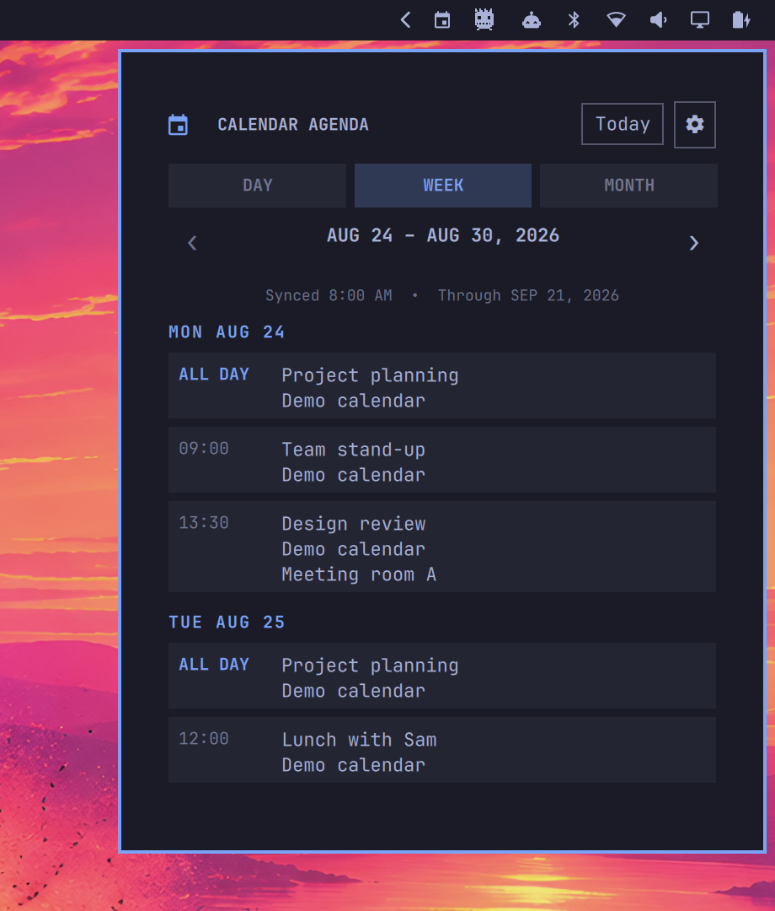
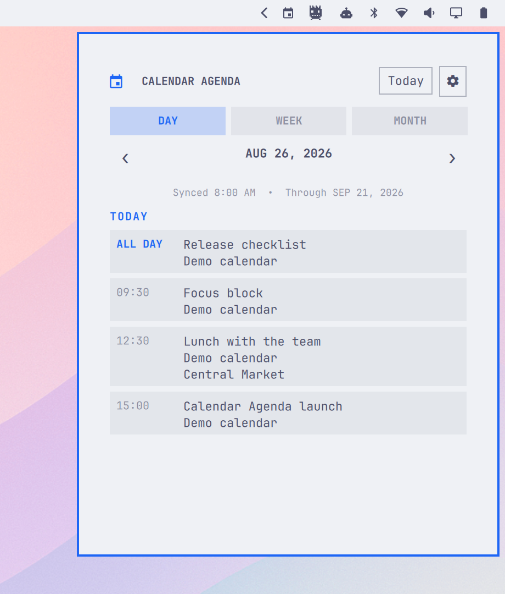
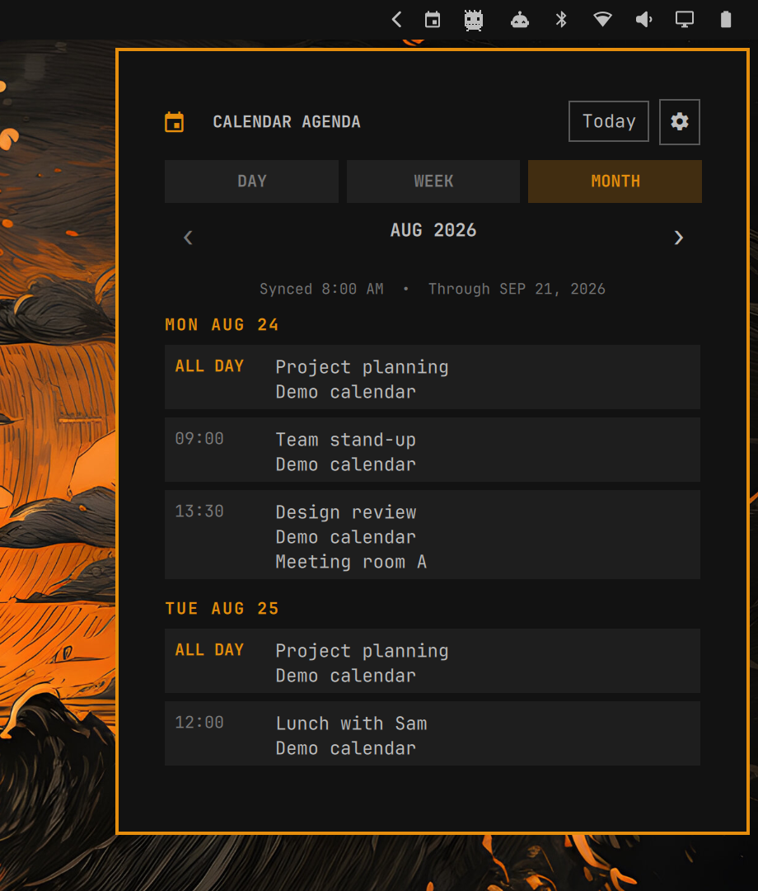

# Calendar Agenda

An [Omarchy](https://omarchy.org) bar widget for Google Calendar. The bar keeps
one quiet calendar icon in the top-right. Click it and a theme-aware agenda
drops down with the day, the week, or the month—without opening a browser or
giving anything permission to change your calendar.

| Tokyo Night · Week | Catppuccin Latte · Day | Matte Black · Month |
| --- | --- | --- |
|  |  |  |

The same agenda under three Omarchy themes. Colors, borders, type, and the
surrounding desktop all follow the active theme; the calendar stays where an
Omarchy utility belongs, directly beneath its bar icon.

## Install

```bash
omarchy plugin add https://github.com/alexinslc/omarchy-calendar-agenda.git --enable
```

The calendar icon lands in the right section of the bar. Move it with
`omarchy bar move`, or from the bar's own settings panel.

Open the icon and choose **Connect Google Calendar**. Sign in through Google's
page in your browser, approve read-only calendar access, and return to the
panel. Calendar Agenda stores the refresh token in Linux Secret Service,
performs the first sync, and enables its 15-minute background timer for you.

That is the whole setup. The Google app and its read-only event access have
completed OAuth verification.

## Connecting accounts

Use **Connect Google Calendar** on first run or **Add account** in Settings.
The browser flow uses authorization-code PKCE, a random state value, and a
loopback callback that accepts the response only on this machine.

After consent, Calendar Agenda:

- discovers the Google identity without asking you to label it by hand;
- stores the refresh token in Secret Service, never in the plugin directory;
- discovers the account's calendars and their colors;
- synchronizes events from now through the next 28 days; and
- enables background synchronization.

Add as many Google accounts as you need. Connecting the same account twice is
rejected, and reconnecting an established account requires the same Google
identity so old cached events cannot be mistaken for a different person's.

## Removing accounts

Open Settings, choose **Remove** beside an account, and confirm. Calendar
Agenda revokes its Google grant, deletes its Secret Service entry, removes the
local account record, and immediately purges that account's cached events. It
never deletes calendars or events in Google.

If Google cannot be reached, **Remove locally anyway** erases the local token
and cache without waiting for remote revocation. The action fails visibly if
either local cleanup step cannot be confirmed.

Removing the last account also disables the plugin-owned sync timer. Remove
connected accounts before uninstalling the plugin so credentials, cache data,
and timer units are cleaned up.

## What it shows

**In the bar**, one calendar glyph and nothing else. The agenda is available
without turning the bar into a strip of dates and counters.

**In the panel**:

- Day, Week, and Month agenda views, all using the same compact event rows.
- All-day events before timed events, grouped under readable date headings.
- Calendar name and event location when those details are enabled.
- A 12- or 24-hour clock, independent of the source calendar.
- Previous and next navigation constrained to the synchronized date range.
- A clear last-sync time and the date through which events are available.
- A Today button that returns from wherever you have browsed.
- Keyboard navigation: `D`, `W`, `M`, `T`, `[` and `]`.

The panel does not invent events when data is missing or stale. An unavailable,
expired, malformed, or partially covered cache is labeled instead of being
presented as a trustworthy empty calendar.

## Settings

| Setting | Default | What it does |
| --- | --- | --- |
| Show time | on | Shows the event's start time or **All day**. |
| Show calendar | on | Shows which Google calendar supplied the event. |
| Show location | on | Shows the event location when one is present. |
| Time format | 24-hour | Switches event times between 24- and 12-hour display. |
| Calendars | all on | Hides individual calendars without changing Google. |
| Accounts | all on | Hides an account's events without disconnecting it. |

Settings is also where accounts are added, reconnected, synchronized on
demand, and removed. Display preferences live locally at
`~/.local/state/omarchy/calendar-agenda/settings.json`.

## How synchronization behaves

The user timer refreshes every 15 minutes. Each run lists the calendars for
every connected account, follows Google pagination, normalizes the next 28
days of events in memory, and atomically replaces the private local cache.
Canceled events are omitted and missing summaries appear as
`(untitled event)`.

One broken account does not prevent healthy accounts from synchronizing.
Settings marks a failed account as **Needs attention** and offers
**Reconnect**. Sync and account-management operations share an inter-process
lock, so a background timer cannot restore data after an account is removed.

The cache is mode `0600` at:

```text
~/.local/state/omarchy/calendar-agenda/events.json
```

## Keeping calendar data private

Omarchy plugins run with the user's permissions, so this repository, its
review process, and release provenance are part of the security boundary.
Calendar Agenda keeps that boundary deliberately small:

- Google access is limited to calendar-list and event read-only scopes.
- OAuth runs in the system browser; the plugin never sees the Google password.
- Refresh tokens live in Linux Secret Service.
- Calendar data and account metadata stay in private local files.
- Google tokens, identity, calendars, and events travel directly between this
  machine and fixed Google HTTPS endpoints.
- QML invokes only the bundled Python helper with fixed argument arrays.
- The helper uses Python's standard library only.
- Releases include checksums, an SBOM, and GitHub artifact attestations.

On first use, the plugin retrieves its distributable Google desktop OAuth
configuration from the fixed
`https://calendar.alexinslc.com/oauth/client-config` endpoint. The response is
strictly validated and cached with private permissions. That endpoint is not
an OAuth broker and never receives authorization codes, tokens, account
identity, calendars, or events.

See the public [Privacy Policy](https://calendar.alexinslc.com/privacy/) and
[SECURITY.md](SECURITY.md) for the full data-handling and trust-boundary
details.

## Diagnostics

From the installed plugin directory:

```bash
python3 calendar_agenda.py --status
python3 calendar_agenda.py --doctor
python3 calendar_agenda.py --sync --json
```

The account registry and per-account health record are private files under
`~/.local/state/omarchy/calendar-agenda/`. Refresh tokens never appear in
those files, command-line arguments, or logs.

## Removing the plugin

Remove connected accounts in Settings first, then:

```bash
omarchy plugin remove io.github.alexinslc.calendar-agenda
```

Removing accounts first revokes Google access and cleans up private state. The
plugin removal itself removes the widget and its installed source.

## Development

The permanent plugin ID is `io.github.alexinslc.calendar-agenda`. For local
development, copy the runtime files without a network checkout:

```bash
mkdir -p ~/.config/omarchy/plugins/io.github.alexinslc.calendar-agenda
cp manifest.json AgendaBarWidget.qml AgendaPanel.qml AgendaModel.js \
  CompactToggle.qml SettingsPanel.qml OnboardingService.qml \
  OnboardingPanel.qml calendar_agenda.py \
  ~/.config/omarchy/plugins/io.github.alexinslc.calendar-agenda/
cp -r sync systemd ~/.config/omarchy/plugins/io.github.alexinslc.calendar-agenda/
omarchy-shell shell rescanPlugins
```

The manifest's `defaultSection` is `right`; `shell.json` remains the source of
truth and can move the widget elsewhere.

Developers can bypass the production configuration endpoint with a private
Google Cloud test project:

```bash
mkdir -p ~/.config/omarchy/calendar-agenda
cp oauth-client.example.json ~/.config/omarchy/calendar-agenda/config.json
chmod 600 ~/.config/omarchy/calendar-agenda/config.json
```

Enable the Google Calendar API and configure these scopes:

- `openid`
- `email`
- `https://www.googleapis.com/auth/calendar.calendarlist.readonly`
- `https://www.googleapis.com/auth/calendar.events.readonly`

Use the Desktop client ID and secret issued together for that private test
project. Desktop applications are public OAuth clients and cannot keep
distributed client configuration confidential; PKCE protects each
authorization-code exchange independently.

Run the local checks before opening a pull request:

```bash
omarchy plugin validate .
python3 -m unittest discover -s tests -v
timeout 5s env QT_QPA_PLATFORM=offscreen quickshell -p model_test.qml
```

The final timeout is expected because a standalone Quickshell config has no
application-level quit handler; a successful run prints
`agenda model tests passed`.

## Public website

The OAuth homepage, privacy policy, and terms are plain static files in
`site/`. A small Cloudflare Worker serves the fixed production desktop-client
configuration from encrypted secret bindings and delegates every other
request to Workers Static Assets.

Preview or deploy with Omarchy's Node.js and a pinned Wrangler version:

```bash
WRANGLER_SEND_METRICS=false npx --yes wrangler@4.125.0 dev
WRANGLER_SEND_METRICS=false npx --yes wrangler@4.125.0 deploy
```

No framework, analytics, Cloudflare Tunnel, project-local dependency tree, or
global npm package is used. Never put Worker secret values in Git, `.dev.vars`,
or command history.

## Releases

Push a tag matching the version in `manifest.json`, such as `v0.2.0`, to run
the release workflow. It validates the project, builds a source archive,
generates SHA-256 checksums and an SPDX JSON SBOM, creates a GitHub release,
and records build provenance for the archive and checksums.

## License

Calendar Agenda is available under the [MIT License](LICENSE). It retains the
upstream Omarchy attribution because its bar-widget structure was originally
prototyped from Omarchy's built-in clock plugin.
